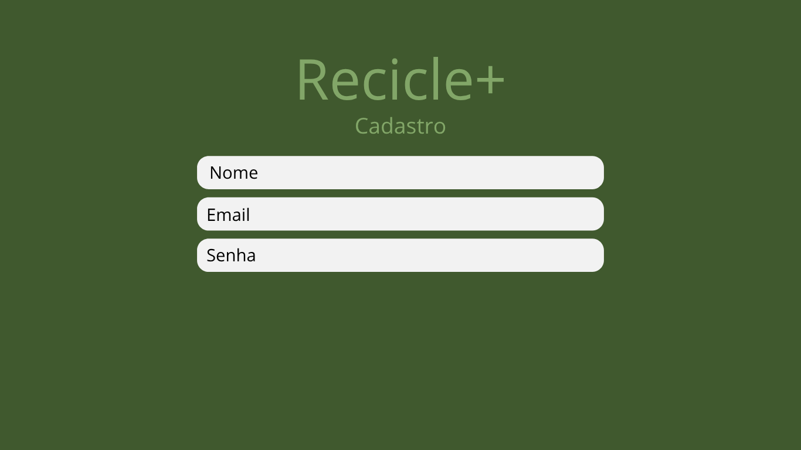

# Recicle +
# 1.Identificação do projeto
## Equipe: 
- Chrislley Emylly
- Francisco Flávio
- Jaubert Junior
- Thiario Lima
## Disciplina
Projeto Integrador
## Professor
Ely Miranda

-----
# 2. Problema a ser Resolvido
O descarte inadequado de resíduos sólidos é um dos principais desafios ambientais no Brasil. Apesar da existência da Política Nacional de Resíduos Sólidos (Lei nº 12.305/2010), grande parte da população não possui acesso facilitado às informações sobre locais corretos para descarte de materiais recicláveis. 

# 3. Objetivo do Projeto
O projeto Recicle+ tem como objetivo facilitar a logística reversa de resíduos recicláveis, reduzir o descarte inadequado em aterros sanitários e promover a conscientização ambiental da população. A proposta busca oferecer uma solução tecnológica acessível que conecte cidadãos a pontos de coleta seletiva, incentivando práticas sustentáveis e contribuindo para a preservação ambiental e melhoria da qualidade de vida.

# 4. Público-Alvo
- Cidadãos

# 5. Tecnologias Utilizadas
| Área | Tecnologia |
|------|------------|
| Front-end | HTML / CSS / JS |
| Back-end | Flask |
| Banco | MySQL|
| Prototipação | Canva |
| Gestão | Trello |


## Histórias de Usuário
- Como usuário quero fazer login com minhas credenciais para acessar o sistema.
- Como cidadão eu quero buscar por pontos de coleta seletiva mais próximos de minha residência ou de outro lugar selecionado.
- Como cidadão quero filtrar os locais por um tipo específico de resíduos.
- Como cidadão quero visualizar o ranking de usuários, para que possa comparar meu engajamento com o de outros.
- Como cidadão eu quero realizar denúncias de pontos de coleta insalubres para manter a integridade do sistema.
- Como cidadão eu quero acessar informações educativas sobre reciclagem.
- Como cidadão quero visualizar meu perfil para adicionar ou alterar uma foto de perfil.
- Como cidadão, quero compartilhar meu progresso no ranking em redes sociais, para que eu incentive meus amigos a também reciclarem.
- Como cidadão quero Reportar Erros no sistema.
- Como administrador eu quero conseguir  um registro com os acessos do sistema para manter um controle de sessões. 

# 7. Modelagem do Sistema
- motivo da ausência: falta do detalhamento devido das historias e interfaces
- etapa em que será produzido: Planejamento das sprints;
- Previsão de entrega: 04/04/26;
- 
# 8. Protótipos
## Tela de Login

## Dashboard

## Cadastro

---
# 9. Planejamento do Projeto
## Cronograma
| Etapa | Período |
|------|---------|
| Levantamento | xx/xx a xx/xx |
| Protótipos | xx/xx a xx/xx |
| Implementação | xx/xx a xx/xx |
## Sprints
| Sprint | Entregas |
|-------|----------|
| Sprint 1 | Login + Banco |

| Sprint 2 | Dashboard |
| Sprint 3 | Relatórios |
## Gestão das Tarefas

## Histórico de Entregas
- Entrega 1: documentação inicial
- Entrega 2: protótipos
- Entrega 3: implementação parcial
---
# 10. Banco de Dados
## Estrutura
Arquivos disponíveis:
- `database/ddl.sql`
- `database/dml.sql`
- `database/schema.sql`
- `database/seeds.sql`
## Modelo Visual

## Observações
Descrever decisões tomadas na modelagem.
---
# 11. Implementação
## Backend
Descrever API, rotas ou regras implementadas.
## Frontend
Descrever telas já desenvolvidas.
## Funcionalidades Concluídas
- Login
- Cadastro
- Consulta
## Funcionalidades em Desenvolvimento

- Relatórios
- Painel administrativo
---
# 12. Evidências do Projeto
## Sistema Rodando

## Tela Login Real

## Dashboard Implementado

## Banco Funcionando

## API Testada

## Demonstração
Inserir vídeo:
`docs/apresentacao/demo.mp4`
---
# 13. Itens Ainda Não Produzidos
> Nenhuma seção deve ficar vazia.
## Exemplo:
### Diagrama de Classes
Ainda não elaborado, pois a modelagem orientada a objetos está em andamento.
Previsão: Sprint 2.
### Front-end Completo
Interfaces finais ainda em desenvolvimento.
---

# 14. Como Executar o Projeto
```bash
git clone URL_DO_REPOSITORIO
cd nome-do-projeto
etc...


---
# Artefatos:
- [Backlog, Atores e listagem interfaces](https://docs.google.com/document/d/1K4Hd_IH8MM24_qvR4_lN34swMgaSWgAQFqfg65YzfRs/edit?usp=sharing)
- [Reunião Briefing](https://docs.google.com/document/d/1kFNeafuiMCbmd1xoZLPTGJzVyshhyYIH-ptcpnavkk0/edit?usp=sharing)
- [Visão de produto](https://drive.google.com/file/d/1KNAH8mf7jMtESUcYrThYnXtQqzClCc2m/view?usp=sharing)
- [ENFN](https://drive.google.com/file/d/11W6RqdmqbSSt0tMyCO_v2X_3Zd5Vpga4/view?usp=sharing)
- [Pesquisa de mercado](https://drive.google.com/file/d/1GnNZ5YMCCGvtuoNXn3hkHcamuxTKmbGM/view?usp=sharing)
# progresso:
- Análise de requisitos(concluido)
- Definição de Atores(concluido)
- Definição de Interfaces(concluido)
- Definição de dados(concluido)
- Product Backlog(concluido)
- Detalhamento das funcionalidades(concluido)
- Histórias de usuários(concluido)
- Telas e caminho dos usuários(em desenvolvimento)
- Prototipação detalhada das telas(em desenvolvimento)
- Definição de sprints de implementação(pendente)
- Implementação(pendente)


